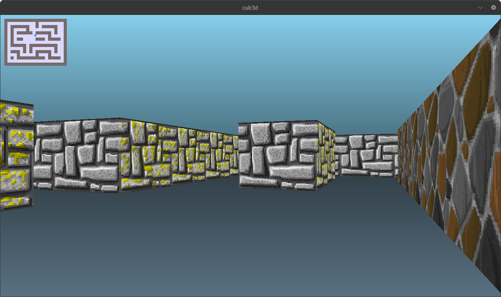

# 🕹️ cub3d



## 📋 Table of Contents
- [Introduction](#📜-introduction)
- [Features](#✨-features)
- [Requirements](#📦-requirements)
- [How to Compile](#⚙️-how-to-compile)
- [How to Run](#▶️-how-to-run)
- [Controls](#🎮-controls)
- [Credits](#🙌-credits)

## 📜 Introduction

**cub3D** is a 3D graphical project inspired by the classic *Wolfenstein 3D*. It uses raycasting to simulate a 3D environment within a 2D map.

This project is part of the 42 curriculum and focuses on mastering raycasting, player movement, wall collisions, and basic graphical rendering.

## ✨ Features

- **Raycasting** for 3D environment rendering.
- Smooth **player movement** in all directions.
- Accurate **wall collision detection** to prevent passing through walls.
- **Minimap** view.

## 📦 Requirements
- **OS**: Linux / macOS
- **Libraries**: *minilibx* for rendering graphics
- **Compiler**: *gcc* or equivalent

## ⚙️ How to Compile

1. Clone the repository:
    ```bash
    git clone https://github.com/mariusz-smajdor/cub3d.git && cd cub3d
    ```
1. Run the *makefile*:
    ```bash
    make
    ```

1. Executable will be generated as *cub3d*

## ▶️ How to Run

Run the program by providing a valid map file:
```
./cub3D maps/example_map.cub
```
Ensure the map follows the required format with walls (*1*), open spaces (*0*), and player start positions.

## 🎮 Controls

- **W/A/S/D**: Move forward, left, backward, and right.
- **Left/Right Arrow**: Rotate the player's view.
- **Mouse**: Rotate view smoothly (Bonus).
- **ESC**: Quit the game.

## 🙌 Credits
This project was created by [mariusz-smajdor](https://github.com/mariusz-smajdor) as part of the 42 School curriculum.
